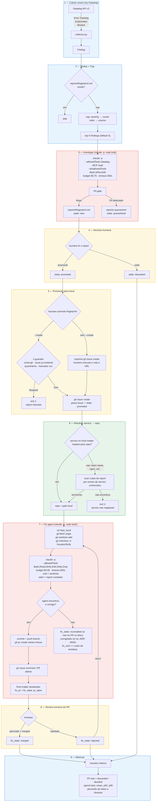

# Pipeline Houston

```mermaid
flowchart TD
    subgraph COLLECT["1 — Coletar (read-only Datadog)"]
        A[Datadog API v2] -->|Error Tracking<br>Kubernetes<br>Monitor| B[collector.py]
        B --> C[Finding]
    end

    subgraph DEDUP["2 — Dedup + Cap"]
        C --> D{reports/fingerprint.md<br>existe?}
        D -->|sim| E[skip]
        D -->|nao| F[cap: severity → round-robin → volume]
        F --> G["top N findings (default 5)"]
    end

    subgraph INVESTIGATE["3 — Investigar (claude -p, read-only)"]
        G --> H["claude -p<br>--allowedTools Datadog MCP read<br>--disallowedTools Bash,Write,Edit<br>budget $0.75 · timeout 300s"]
        H --> I[PII gate]
        I -->|limpo| J["reports/fingerprint.md<br>state: new"]
        I -->|PII detectado| K["reports/.quarantine/<br>state: quarantined"]
    end

    subgraph DECIDE["4 — Decisao humana"]
        J --> L{humano le o report}
        L -->|acionavel| M["state: promoted"]
        L -->|ruido| N["state: discarded"]
    end

    subgraph PROMOTE["5 — Promover para issue"]
        M --> O{"houston promote fingerprint"}
        O -->|sem --create| O2["imprime gh issue create<br>humano executa e cola a URL"]
        O -->|--create| O3{"4 guardas:<br>conta gh · issue ja existente<br>quarentena · marcador cru"}
        O3 -->|bloqueio| O4["exit 1:<br>report intocado"]
        O3 -->|livre| P["gh issue create<br>grava issue: + state: promoted"]
        O2 --> P
    end

    subgraph RESOLVE["6 — Resolver servico → repo"]
        P --> Q{service no front-matter<br>mapeia para repo?}
        Q -->|sim| S[repo + path local]
        Q -->|nao: team name,<br>nginx, etc.| R["scan corpo do report<br>por nomes de servico conhecidos"]
        R -->|encontrou| S
        R -->|nao encontrou| T["exit 1:<br>servico nao mapeavel"]
    end

    subgraph FIX["7 — Fix agent (claude -p, code tools)"]
        S --> U["cd repo_local<br>git fetch origin<br>git worktree add<br>git checkout -b houston/fix/fp"]
        U --> V["claude -p<br>--allowedTools Bash,Read,Write,Edit,Glob,Grep<br>budget $3.00 · timeout 600s<br>cwd = worktree<br>stdin = report completo"]
        V --> W{agent encontrou<br>e corrigiu?}
        W -->|sim| X["commit + push branch<br>gh pr create closes #issue"]
        W -->|nao| Y["fix_state: incomplete se nao ha PR no disco<br>(congelado se ha, ADR-0034)<br>fix_cost += custo da tentativa"]
        X --> Z["gh issue comment: PR aberto"]
        Z --> AA["front-matter atualizado:<br>fix_pr + fix_state: pr_open"]
    end

    subgraph REVIEW["8 — Review humano do PR"]
        AA --> BB{reviewer}
        BB -->|aprovado + merged| CC["fix_state: merged"]
        BB -->|rejeitado| DD["fix_state: rejected"]
        DD -->|retry?| U
    end

    subgraph METRICS["9 — Metricas"]
        CC & DD & N --> EE["houston metrics"]
        EE --> FF["FP rate = discarded / decided<br>spend total, mean, p50, p95<br>percentis de token e duracao"]
    end

    style COLLECT fill:#e8f4fd,stroke:#1a73e8
    style DEDUP fill:#e8f4fd,stroke:#1a73e8
    style INVESTIGATE fill:#fce8e6,stroke:#d93025
    style DECIDE fill:#fef7e0,stroke:#f9ab00
    style PROMOTE fill:#fef7e0,stroke:#f9ab00
    style RESOLVE fill:#e6f4ea,stroke:#1e8e3e
    style FIX fill:#fce8e6,stroke:#d93025
    style REVIEW fill:#fef7e0,stroke:#f9ab00
    style METRICS fill:#e8f4fd,stroke:#1a73e8
```

Legenda:
- **Azul**: deterministico, sem custo LLM
- **Vermelho**: etapas com custo LLM (claude -p)
- **Amarelo**: decisao humana
- **Verde**: resolucao de servico
